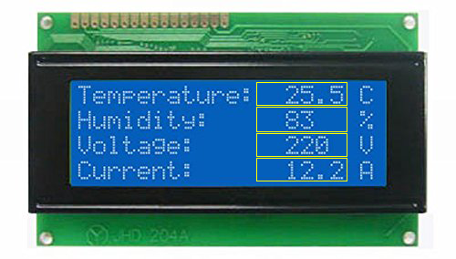

# DisplayBlock

## Introduction

This library provides the ability to address an Adafruit_LiquidCrystal 
display in "Blocks". This enables you to configure your output locations
during initialization and then just output new values to the Block leaving
your screen code free of clear() and setCursor() calls. The Blocks
can each have unique alignment (left, center, right). Bounds of blocks
are strictly enforced, so you don't have to worry about writing too
much data to a Block. 

**Note:**

block.printf(...) and block.displayf(...) mehtods (which
are printf compatible) are provided but do not appear to currently 
work with Arduino (they output no data) but do work with ESP8266.

## What I know works

* Adafruit Huzzah Feather ESP8266
* Arduino Uno R3
* Adafruit LCD Backpack
* Adafruit 20x4 LCD

## Usage



The above image is of a monochrome 20x4 LCD - this is just a sample image from Google Images, but I think it's representative of how a lot of people are using LCDs for their microcontroller projects. The four yellow boxes aren't actually part of what is displayed on the LCD, I've placed the boxes there to demonstrate the logical blocks of data. When your program runs, these are the only values you really want to have to update, the rest of the screen is completely static. 

The below code (which comes from my fourFields.ino example, but is much more annotated there):

```
#include <Wire.h>
#include "RTClib.h"
#include "Adafruit_LiquidCrystal.h"
#include "LCDBlock.h"

#define LCD_ROWS 4
#define LCD_COLS 20

Adafruit_LiquidCrystal lcd(0);
LCDBlock tempBlock =    LCDBlock(&lcd, 0 /* row# */, 12 /* col# */, 6 /* width */);
LCDBlock humidBlock =   LCDBlock(&lcd, 1, 12, 6);
LCDBlock voltBlock =    LCDBlock(&lcd, 2, 12, 6);
LCDBlock currentBlock = LCDBlock(&lcd, 3, 12, 6);

void setup() {
  Serial.begin(9600);

  // Initialize the LCD
  lcd.begin(LCD_COLS, LCD_ROWS);

  // Additional configuration of the blocks
  tempBlock.setAlignment(LCDBLOCK_ALIGN_RIGHT);
  humidBlock.setAlignment(LCDBLOCK_ALIGN_CENTER);
  voltBlock.setAlignment(LCDBLOCK_ALIGN_CENTER);
  currentBlock.setAlignment(LCDBLOCK_ALIGN_RIGHT);

  // Print the screen with blank spaces for the blocks
  lcd.setCursor(0, 0); lcd.print("Temperature:       C");
  lcd.setCursor(0, 1); lcd.print("Humidity:          %");
  lcd.setCursor(0, 2); lcd.print("Current:           V");
  lcd.setCursor(0, 3); lcd.print("Voltage:           A");
}

void loop() {
    // Update variables for output to use
    double temp    =  25 + random(9) + ((double) 1 / (random(10) + 1));
    int humudity   =  80 + random(9);
    int voltage    = 220 + random(9);
    float current  =   12 + random(3) + ((double) 1 / (random(10) + 1));

    tempBlock.display(temp, 1);
    humidBlock.displayf("%d", humudity);
    voltBlock.display(voltage);
    currentBlock.clear(); currentBlock.print(current, 1); currentBlock.display();

    delay(1000);
}
```

## Memory Consumption

I created a version of the example LCDBlocks_20x4 that prints the same data 
with rougly similar formatting.

It might be instructive to compare the memory used by NoBlocks vs the memory 
used if you use one, two, etc. Blocks (if the overhead is liner per-Block
or if the first Block has the highest penalty). This is much more of a 
concern with Arduino as the ESP8266 has a lot more memory. I'm not likely
to do much optimization for Arduino at the time as I my projects are all
currently centered around the ESP8266.

*These values are provided as estimates only. You should do your own testing.*

### Arduino UNO R3

**LCDBlocks_20x4.ino**

```
Sketch uses 11,874 bytes (36%) of program storage space. Maximum is 32,256 bytes.
Global variables use 560 bytes (27%) of dynamic memory, leaving 1,488 bytes for local variables. Maximum is 2,048 bytes.
```

**NoBlocks_20x4.ino**

```
Sketch uses 8,186 bytes (25%) of program storage space. Maximum is 32,256 bytes.
Global variables use 482 bytes (23%) of dynamic memory, leaving 1,566 bytes for local variables. Maximum is 2,048 bytes.

```

### Huzzah Feather ESP82266

**LCDBlocks_20x4.ino**

```
Sketch uses 235,830 bytes (22%) of program storage space. Maximum is 1,044,464 bytes.
Global variables use 31,981 bytes (39%) of dynamic memory, leaving 49,939 bytes for local variables. Maximum is 81,920 bytes.
```

**NoBlocks_20x4.ino**

```
Sketch uses 235,122 bytes (22%) of program storage space. Maximum is 1,044,464 bytes.
Global variables use 31,825 bytes (38%) of dynamic memory, leaving 50,095 bytes for local variables. Maximum is 81,920 bytes.
```

## Known issues

* printf() and displayf() functions don't work with Arduino but do work with ESP8266.

## Future directions

* This is early code and will probably be extended to support the SSD1306 or similar OLED devices. 
* Perhaps redraw only individual characters that have changed. This may be overkill and actually hurt performance.

## Fork me

Feel free to fork and extend this code, but I will be doing a sizable refactor soon when I add support for at least one more kind of display (probably a 128x64 OLED, perhaps the SSD1306). I imagine I will keep the interface about the same, but the internals will likely shuffle into a new base class.
